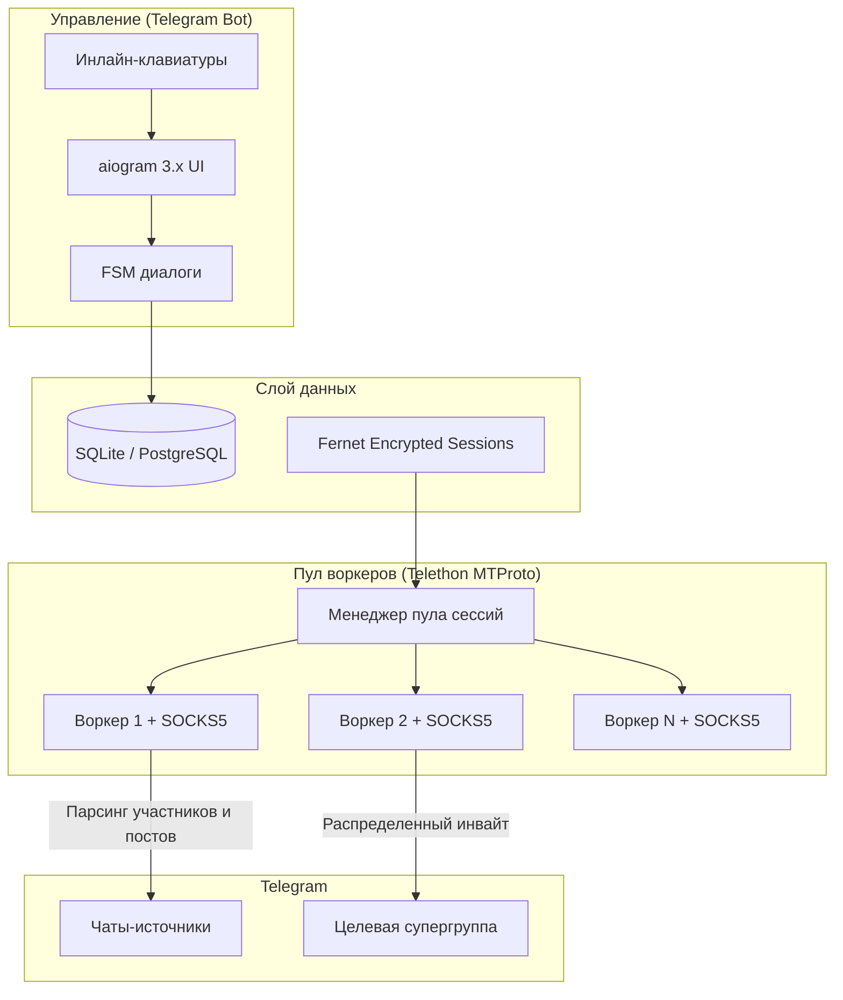

# TG-Invite-Machine

Асинхронный инструмент сбора аудитории и распределенного инвайтинга в Telegram с управлением через Telegram-бота. 

Проект спроектирован для безопасного масштабирования: пул сессий, привязка индивидуальных прокси, многоступенчатая защита от флуд-блокировок и эмуляция органического поведения пользователей.

## Архитектура системы

Вся работа оператора происходит через Telegram-бота (Control Plane). Сессии воркеров выполняют сетевые вызовы к MTProto API автономно (Data Plane).



## Ключевые возможности

### 1. Импорт и безопасность сессий
* **Импорт TData (.zip)**: распаковка архивов с автоматической конвертацией в сессию через `opentele2` и обходом `AUTH_KEY_DUPLICATED`. Поддерживаются пароли двухэтапной аутентификации (2FA).
* **Импорт одиночных .session**: моментальная загрузка и проверка валидности.
* **Шифрование сессий в базе**: сессионные токены хранятся в зашифрованном виде (Fernet, AES-128-CBC + HMAC-SHA256).
* **Сетевая изоляция**: каждому аккаунту назначается собственный SOCKS5/HTTP прокси для предотвращения кросс-банов по IP.

### 2. Сбор аудитории (Collector)
* **Сбор всех участников**: итерация по участникам открытых групп с поисковой разбивкой по алфавиту для обхода серверного лимита Telegram в 10 000 профилей.
* **Сбор активной аудитории**: извлечение авторов сообщений за последние 1-30 дней из истории чата или комментариев привязанной к каналу группы.
* **Фильтрация**: отсеивание ботов, удаленных профилей и дубликатов.
* **Экспорт**: автоматическая отправка сформированного `.txt` файла в чат с ботом.

### 3. Защита от блокировок и алгоритм инвайтинга (Inviter)
* **Модель человеческих пауз (Burst Delay)**: исключает равномерные интервалы робота. 25% быстрый клик, 60% средний темп, 15% долгое отвлечение. Пауза применяется между инвайтами одного воркера.
* **Pre-invite эмуляция**: воркер выставляет онлайн-статус, открывает целевую группу, просматривает 3-7 последних публикаций и отправляет маркер прочтения перед добавлением участника.
* **Классификация ошибок**:
  * `UserPrivacyRestrictedError`: постоянный пропуск и фиксация в базе.
  * `FloodWaitError`: временная отлежка аккаунта на время блокировки, участник уходит в `deferred` для ручного разбора.
  * `PeerFloodError`: 24-часовая отлежка и снижение лимита, участник уходит в `deferred`.
* **Circuit Breaker**: автоматическая приостановка задачи при фиксации серии флуд-ошибок для сохранения остального пула аккаунтов.
* **Проверка @SpamBot**: пакетный аудит ограничений сессий в фоновом режиме.

## Стек технологий

* **Язык**: Python 3.12+
* **Бот управления**: aiogram 3.31+
* **MTProto движок**: Telethon 1.45+
* **Конвертер TData**: opentele2
* **База данных**: SQLAlchemy 2.0 (asyncpg / aiosqlite)
* **Безопасность**: Cryptography (Fernet)
* **Контейнеризация**: Docker & Docker Compose

## Структура проекта

```
tg-invite-machine/
├── app/
│   ├── bot/
│   │   ├── handlers/        # Обработчики меню, аккаунтов, прокси, парсера, инвайтера
│   │   ├── middlewares/     # Проверка прав администратора бота
│   │   ├── keyboards.py     # Инлайн-клавиатуры и меню
│   │   └── states.py        # Состояния FSM диалогов
│   ├── core/
│   │   ├── config.py        # Конфигурация Pydantic v2
│   │   ├── database.py      # Асинхронное подключение SQLAlchemy и сессии
│   │   ├── security.py      # Шифрование сессий Fernet и безопасная распаковка ZIP
│   │   └── utils.py         # Нормализация ссылок и юзернеймов чатов
│   ├── models/
│   │   └── models.py        # Модели базы данных: аккаунты, прокси, задачи, аудитория
│   ├── services/
│   │   ├── collector_service.py # Парсер участников чатов и истории сообщений
│   │   ├── export_service.py    # Генерация отчетов по аккаунтам в Excel (.xlsx)
│   │   ├── inviter_service.py   # Оркестратор распределенного инвайта и защита от флуда
│   │   ├── proxy_service.py     # Парсинг прокси и проверка доступности через TCP
│   │   └── spambot_service.py   # Автоматическая проверка ограничений через @SpamBot
│   ├── telegram/
│   │   ├── client_factory.py    # Фабрика клиентов Telethon со строгой привязкой прокси
│   │   └── converter.py         # Импорт и конвертация TData и файлов .session
│   └── main.py              # Точка входа и запуск бота
├── data/                    # Постоянные файлы базы (inviter.db) и выгрузок
├── tests/                   # Набор тестов pytest (33 unit и интеграционных тестов)
├── Dockerfile               # Контейнеризация сервиса
├── docker-compose.yml       # Спецификация для развертывания
├── requirements.txt         # Зависимости проекта
└── .env.example             # Шаблон переменных окружения
```

## Быстрый старт

### 1. Клонирование и настройка окружения
```bash
git clone https://github.com/ivanchik-byte/tg-invite-machine.git
cd tg-invite-machine
cp .env.example .env
```

### 2. Генерация ключа шифрования и заполнение .env
Сгенерируйте секретный ключ для шифрования сессий:
```bash
python3 -c "from cryptography.fernet import Fernet; print(Fernet.generate_key().decode())"
```

Откройте `.env` и укажите параметры:
```env
BOT_TOKEN=ваш_токен_от_BotFather
ADMIN_ID=ваш_telegram_id
TELEGRAM_API_ID=ваш_api_id
TELEGRAM_API_HASH=ваш_api_hash
ENCRYPTION_KEY=сгенерированный_fernet_ключ
```

### 3. Запуск через Docker Compose (рекомендуется)
```bash
docker compose up -d --build
```

### 4. Локальный запуск без Docker
```bash
python3 -m venv venv
source venv/bin/activate
pip install -r requirements.txt
python -m app.main
```

## Запуск тестов
```bash
pytest
```

## Лицензия
MIT License. Проект создан исключительно в демонстрационных и образовательных целях.
