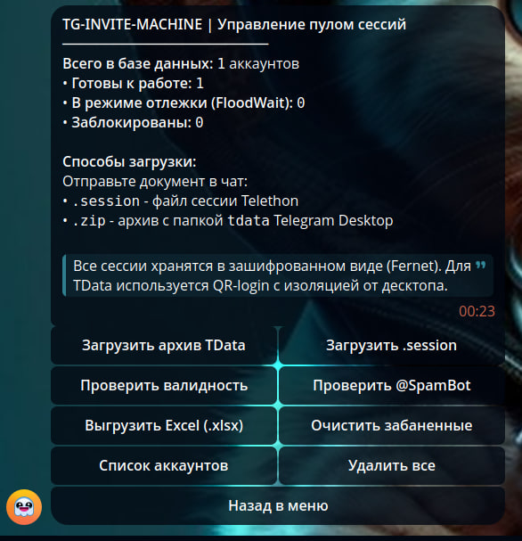
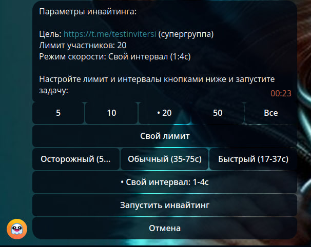
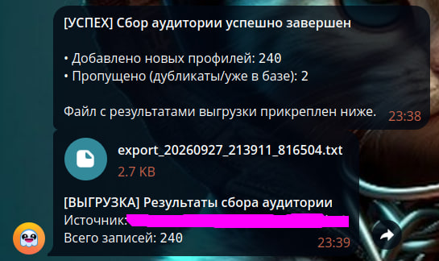
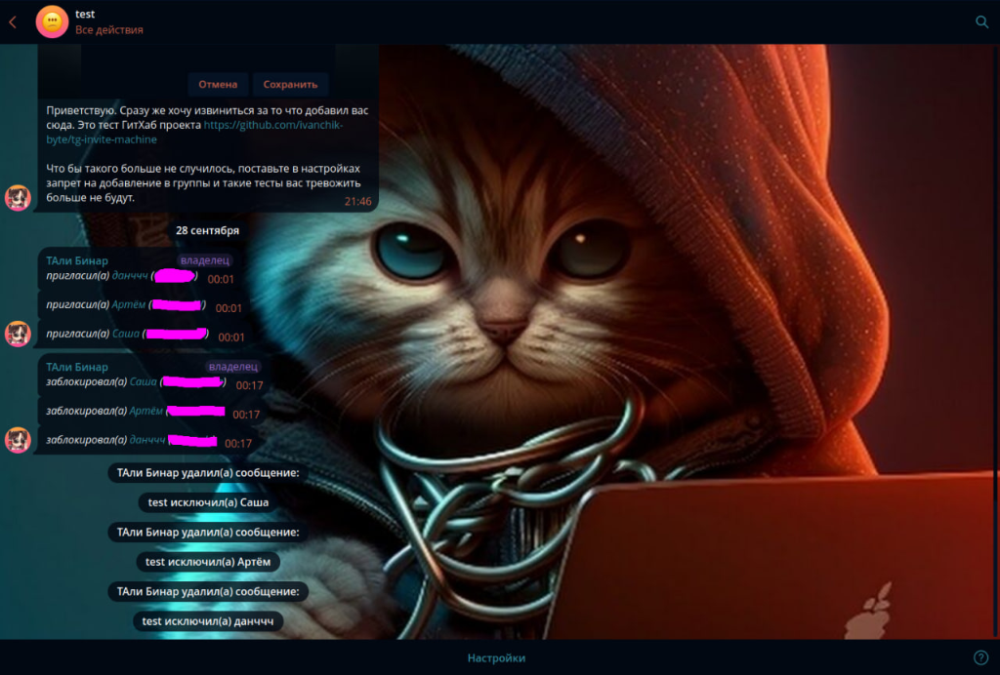
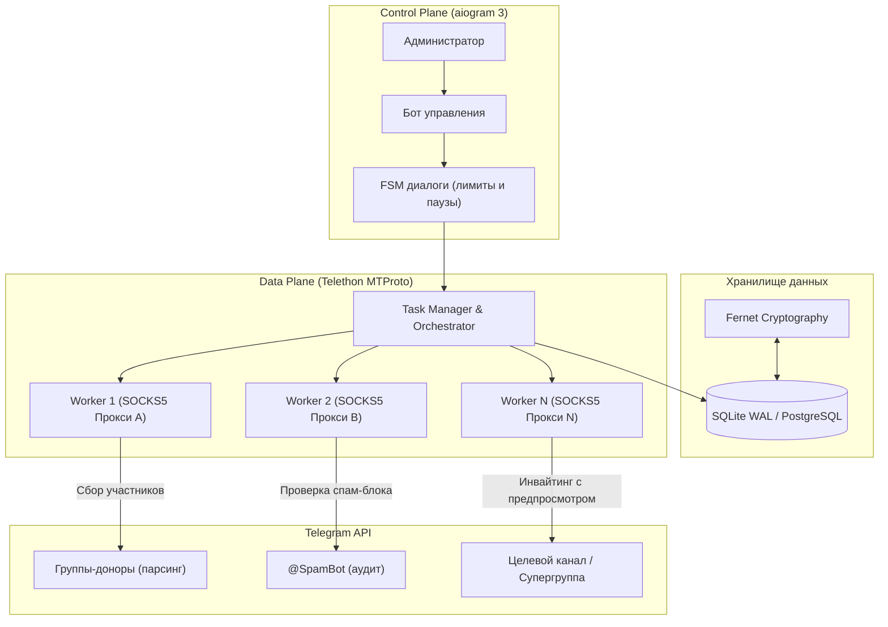

# TG-Invite-Machine

Асинхронная система распределенного сбора аудитории и инвайтинга в Telegram на базе Telethon и Aiogram 3 с изолированным пулом рабочих сессий.

<p align="left">
  <a href="https://t.me/ivanchik_byte"></a>
  <a href="https://t.me/ivanchikbyte"></a>
  <a href="https://github.com/ivanchik-byte/tg-invite-machine"></a>
  <a href="tests/"></a>
</p>

> Статус: версия v0.1.1-stable. Кодовая база покрыта набором из 60 автоматизированных тестов. Вопросы по развертыванию или предложения можно отправлять в личные сообщения или открывать в issues.


> [!IMPORTANT]
> **ДИСКЛЕЙМЕР / DISCLAIMER**: Данный программный комплекс разработан исключительно в образовательных целях, для исследования протокола MTProto и тестирования асинхронной архитектуры. Автор и разработчики не несут ответственности за любые последствия использования данного ПО, включая блокировки аккаунтов Telegram, ограничения каналов или нарушение правил платформы (Telegram Terms of Service). Все действия осуществляются конечным пользователем исключительно на свой страх и риск.

---

## Контакты

- Личные сообщения в Telegram: https://t.me/ivanchikbyte
- Канал проекта: https://t.me/ivanchik_byte

---

## Содержание

1. [Возможности](#возможности)
2. [Технологический стек](#технологический-стек)
3. [Архитектура и схема работы](#архитектура-и-схема-работы)
4. [Требования к окружению](#требования-к-окружению)
5. [Установка и запуск](#установка-и-запуск)
6. [Инструкция по работе с ботом](#инструкция-по-работе-с-ботом)
7. [Переменные окружения (.env)](#переменные-окружения-env)
8. [Тестирование](#тестирование)
9. [Надежность базы данных](#надежность-базы-данных)
10. [Дополнительная документация](#дополнительная-документация)
11. [Отказ от ответственности (Disclaimer)](#отказ-от-ответственности-disclaimer)
12. [Лицензия](#лицензия)

---

## Скриншоты интерфейса

<p align="center">
  
  
</p>
<p align="center">
  
  
</p>
<p align="center"><i>Управление пулом сессий | Выбор лимитов и задержек | Сбор и дедупликация аудитории | Результат инвайтинга</i></p>

---

## Возможности

- **Импорт сессий и двухэтапная аутентификация (2FA)**:
  - Конвертация TData (.zip) через библиотеку opentele2 с правильной привязкой DC и обходом конфликтов `AUTH_KEY_DUPLICATED`.
  - Загрузка одиночных файлов `.session` с валидацией авторизации на лету.
  - Поддержка облачных паролей (2FA): диалоговый запрос пароля, мгновенное удаление сообщения пользователя из чата Telegram и сохранение зашифрованного токена.
  - Пакетный импорт: загрузка ZIP-архива с папками сессий и общим файлом `proxies.txt` для автоматического связывания аккаунтов с прокси.

- **Сетевая изоляция и политика Zero-Leak**:
  - Строгая привязка каждого аккаунта к персональному SOCKS5/HTTP прокси.
  - Защитный контур: при падении или недоступности прокси клиент мгновенно прерывает операцию (fail-fast), предотвращая выход в сеть с прямого IP сервера.
  - Шифрование учетных данных в базе: сессионные токены и пароли защищены симметричным алгоритмом Fernet (AES-128-CBC + HMAC-SHA256).

- **Гибкая предстартовая настройка инвайтинга**:
  - Выбор лимита пользователей через интерактивные чипы: `[ 5 ]`, `[ 10 ]`, `[ 20 ]`, `[ 50 ]`, `[ Все ]` или точный ввод числа через клавиатуру.
  - Остановка задачи: как только достигнут заданный лимит, оркестратор завершает задачу со статусом `completed` и фиксирует точное время окончания.
  - Предустановленные профили задержек:
    - Осторожный: 50-110 секунд, минимальная нагрузка для свежих номеров.
    - Обычный: 35-75 секунд, стандартный баланс скорости и надежности.
    - Быстрый: 17-37 секунд, для прогретых аккаунтов.
  - Ручная настройка интервалов: ввод любого диапазона секунд (например, `40-80`).

- **Алгоритмы защиты от блокировок и антифрод**:
  - Тримодальная модель джиттера: 25% быстрых действий, 60% действий в среднем темпе и 15% долгих пауз для эмуляции поведения живого человека.
  - Предпросмотр чата (Pre-invite): выставление онлайн-статуса, листание 3-7 последних публикаций и отправка отметки прочтения перед добавлением.
  - Приоритет username над access_hash: исключает сбои `UserIdInvalid`, возникающие из-за несовместимости хешей между разными сессиями Telegram.
  - Защитный Circuit Breaker: при серии флуд-ошибок подряд задача автоматически встает на паузу, сохраняя оставшийся пул аккаунтов.
  - Динамический сброс суточных лимитов: счетчики инвайтов на аккаунтах обновляются в основном цикле при смене календарных суток UTC.
  - Автомиграция чатов: при выборе обычной группы бот предлагает мигрировать ее в супергруппу через `MigrateChatRequest`.

- **Сбор аудитории (Collector)**:
  - Сбор активных участников: выгрузка авторов сообщений за последние 1-30 дней из открытых чатов или комментариев каналов.
  - Сбор всех участников: алфавитная итерация по списку пользователей для обхода системного лимита Telegram в 10 000 контактов.
  - Дедупликация: отсев ботов, удаленных аккаунтов и дубликатов на уровне ограничений базы данных.
  - Экспорт: автоматическая отправка сформированного `.txt` файла со списком логинов в чат с ботом.

- **Аудит и аналитика**:
  - Автоматическая пакетная проверка пула аккаунтов через официального `@SpamBot`.
  - Выгрузка отчетов о состоянии базы и сессий в формате Excel (.xlsx).

---

## Технологический стек

- **Язык разработки**: Python 3.12+
- **Бот управления (Control Plane)**: aiogram 3.x (асинхронный роутинг, FSM, middleware)
- **MTProto движок (Data Plane)**: Telethon 1.45+ (асинхронный клиент, управление сессиями)
- **Конвертер TData**: opentele2
- **База данных**: SQLAlchemy 2.0 Async (aiosqlite по умолчанию, полная совместимость с asyncpg / PostgreSQL)
- **Криптография**: Cryptography (Fernet)
- **Экспорт данных**: openpyxl
- **Контейнеризация**: Docker и Docker Compose

---

## Архитектура и схема работы

Управление системой изолировано от сетевых вызовов MTProto:



Подробное техническое описание компонентов и последовательности вызовов приведено в [docs/ARCHITECTURE.md](docs/ARCHITECTURE.md).

---

## Требования к окружению

- Операционная система: Linux (Ubuntu 22.04+, Debian 12+), macOS или Windows (WSL2).
- Оперативная память: от 512 МБ RAM.
- Установленный Docker и Docker Compose V2, либо Python 3.12+.
- Учетные данные приложения Telegram (`api_id` и `api_hash` с my.telegram.org).
- Токен бота от @BotFather.

---

## Установка и запуск

### 1. Клонирование и настройка конфигурации
```bash
git clone https://github.com/ivanchik-byte/tg-invite-machine.git
cd tg-invite-machine
cp .env.example .env

# Сгенерируйте секретный ключ Fernet для шифрования данных
python3 -c "from cryptography.fernet import Fernet; print(Fernet.generate_key().decode())"
```

Заполните значения в созданном файле `.env`.

### 2. Запуск через Docker Compose (Linux / macOS)
```bash
docker compose up -d --build
```

Просмотр логов:
```bash
docker compose logs -f
```

### 3. Запуск через Docker на Windows (Docker Desktop)

1. Установите [Docker Desktop для Windows](https://www.docker.com/products/docker-desktop/) (убедитесь, что включен бэкенд WSL 2 в настройках Docker Desktop).
2. Запустите Docker Desktop и дождитесь статуса `Engine running`.
3. Откройте **PowerShell** или **Терминал Windows** в папке проекта:
```powershell
# Клонирование репозитория (если еще не склонирован)
git clone https://github.com/ivanchik-byte/tg-invite-machine.git
cd tg-invite-machine

# Создание файла конфигурации
Copy-Item .env.example .env

# Генерация ключа Fernet через Python (или любой установленный Python)
python -c "from cryptography.fernet import Fernet; print(Fernet.generate_key().decode())"
```
4. Откройте файл `.env` в блокноте или редакторе кода (`notepad .env`), укажите ваш `BOT_TOKEN`, `ADMIN_ID`, `TELEGRAM_API_ID`, `TELEGRAM_API_HASH` и вставьте сгенерированный ключ `ENCRYPTION_KEY`.
5. Соберите и запустите контейнер:
```powershell
docker compose up -d --build
```
6. Для отслеживания логов выполните:
```powershell
docker compose logs -f
```
7. Для остановки сервиса:
```powershell
docker compose down
```

### 4. Локальный запуск без Docker
```bash
python3 -m venv venv
source venv/bin/activate
pip install -r requirements.txt
python -m app.main
```

Детальное руководство по всем шагам установки находится в файле [INSTALL.md](INSTALL.md).

---

## Инструкция по работе с ботом

После запуска отправьте команду `/start` вашему боту с аккаунта администратора (`ADMIN_ID`).

1. **Добавление прокси**:
   - Перейдите в раздел **Прокси** -> **Добавить прокси**.
   - Отправьте прокси в формате `ip:port:user:pass` или `socks5://user:pass@ip:port`.
   - Система автоматически выполнит проверку TCP-соединения.

2. **Загрузка аккаунтов**:
   - Перейдите в раздел **Аккаунты** -> **Загрузить TData / Session**.
   - Отправьте `.zip` архив с папкой tdata или файл `.session`.
   - Если на номере включен облачный пароль (2FA), введите его в ответном сообщении. Бот автоматически сотрет ваше сообщение из чата для безопасности.

3. **Сбор аудитории**:
   - Перейдите в раздел **Сбор аудитории**.
   - Укажите ссылку на открытый чат или группу с комментариями канала.
   - Выберите режим: сбор активных пользователей (авторы сообщений за последние N дней) или сбор всех участников.
   - По завершении бот сохранит пользователей в базу и пришлет `.txt` файл.

4. **Запуск инвайтинга**:
   - Перейдите в раздел **Инвайтер** -> **Запустить**.
   - Отправьте ссылку на целевой канал или супергруппу.
   - В открывшемся меню параметров выберите лимит участников (`[ 5 ]`, `[ 10 ]`, `[ 20 ]`, `[ 50 ]`, `[ Все ]` или введите свой), а также скоростной режим или интервал в секундах.
   - Нажмите **Запустить инвайтинг**. Ход выполнения и статистика отображаются в реальном времени.

---

## Переменные окружения (.env)

| Параметр | Тип | По умолчанию | Описание |
| :--- | :--- | :--- | :--- |
| `BOT_TOKEN` | string | - | Токен Telegram-бота управления |
| `ADMIN_ID` | int | - | Telegram ID администратора (доступ к боту строго ограничен) |
| `TELEGRAM_API_ID` | int | - | API ID приложения с my.telegram.org |
| `TELEGRAM_API_HASH` | string | - | API Hash приложения с my.telegram.org |
| `ENCRYPTION_KEY` | string | - | 32-байтный base64 ключ Fernet |
| `DATABASE_URL` | string | `sqlite+aiosqlite:///data/inviter.db` | Строка подключения к базе данных |
| `DEFAULT_SPEED_PROFILE`| string | `normal` | Профиль скорости: cautious, normal, fast |
| `MIN_DELAY_BETWEEN_INVITES` | int | `30` | Нижняя граница базовой задержки (сек) |
| `MAX_DELAY_BETWEEN_INVITES` | int | `60` | Верхняя граница базовой задержки (сек) |
| `MAX_INVITES_PER_SESSION_DAILY`| int | `20` | Дневной лимит успешных инвайтов на сессию |
| `CIRCUIT_BREAKER_FLOOD_THRESHOLD`| int | `3` | Порог ошибок для защитной паузы |
| `REQUIRE_STRICT_PROXIES` | bool | `true` | Запрет работы без активного прокси (Zero-Leak) |

---

## Тестирование

Кодовая база покрыта набором автоматизированных тестов:
- Шифрование и дешифрование сессий и 2FA паролей.
- Остановка инвайтинга строго по достижении `max_invites`.
- Расчет тримодальных задержек и кастомных диапазонов `custom:min:max`.
- Алгоритм Circuit Breaker и эмуляция органического чтения.
- Парсинг прокси и защита от утечки IP адреса.
- FSM диалоги и построение инлайн-клавиатур.

Запуск тестового набора:
```bash
./venv/bin/pytest -W error
```

Результат:
```
============================== 50 passed in 5.67s ==============================
```

---

## Надежность базы данных

По умолчанию система использует SQLite через драйвер aiosqlite. Для исключения ошибок блокировки файла при параллельной работе инвайтера, парсера и бота управления настроены следующие параметры:
1. Режим журнала WAL (`PRAGMA journal_mode=WAL;`). Запись не блокирует одновременное чтение.
2. Синхронизация NORMAL (`PRAGMA synchronous=NORMAL;`). Снижает нагрузку на диск без риска повреждения базы данных.
3. Таймаут ожидания блокировки 15 секунд (`connect_args={"timeout": 15}`).
4. Индексы по статусам задач, участникам и датам отлежки.

Для высоконагруженных окружений поддерживается подключение к PostgreSQL через изменение параметра `DATABASE_URL`.

---

## Дополнительная документация

- [docs/ARCHITECTURE.md](docs/ARCHITECTURE.md): подробное техническое описание архитектуры, конвейеров данных и моделей БД.
- [INSTALL.md](INSTALL.md): пошаговое руководство по установке и настройке.
- [SECURITY.md](SECURITY.md): политика безопасности, Zero-Leak модель и правила сообщения об уязвимостях.

---

## Отказ от ответственности (Disclaimer)

Данное программное обеспечение разработано исключительно в ознакомительных, научно-исследовательских и образовательных целях для демонстрации реализации сетевых протоколов (MTProto) и отказоустойчивой асинхронной архитектуры на Python.

- **Использование только для тестов**: Проект предназначен для тестирования на собственных тестовых стендах, каналах и контролируемых тестовых аккаунтах.
- **Отсутствие гарантий**: Программный код предоставляется по принципу "AS IS" ("КАК ЕСТЬ"), без каких-либо явных или подразумеваемых гарантий безошибочности, надежности или пригодности для определенных сценариев.
- **Ограничение ответственности**: Автор, контрибьюторы и лица, связанные с разработкой, ни при каких обстоятельствах не несут ответственности за любые прямые, косвенные или случайные последствия использования или невозможности использования данного ПО. Это включает, но не ограничивается:
  - Временные или постоянные ограничения и блокировки учетных записей Telegram (PeerFlood, FloodWait, SpamBot restrictions, удаление номеров).
  - Ограничение видимости, принудительное удаление или наложение фильтров на каналы, чаты и группы.
  - Потерю данных, утечку сессий при некорректном хранении или финансовые издержки.
- **Соблюдение правил платформы**: Пользователь несет единоличную и полную персональную ответственность за соблюдение Пользовательского соглашения Telegram (Telegram Terms of Service), спам-политики сервиса и законов своей страны.
- **Использование на свой страх и риск**: Любые действия по импорту сессий, отправке запросов через MTProto и управлению контактами выполняются вами исключительно под вашу личную ответственность.

---

## Лицензия

MIT License. Исходный код предоставлен в образовательных и исследовательских целях.

