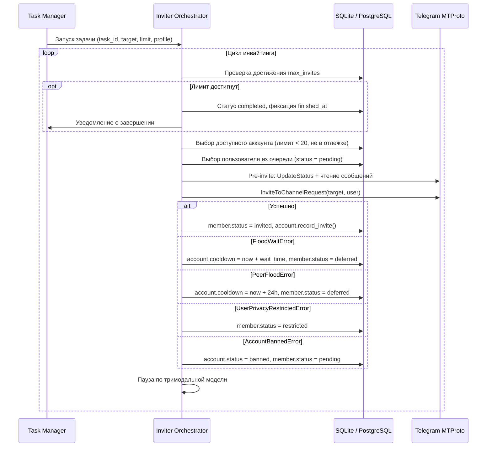
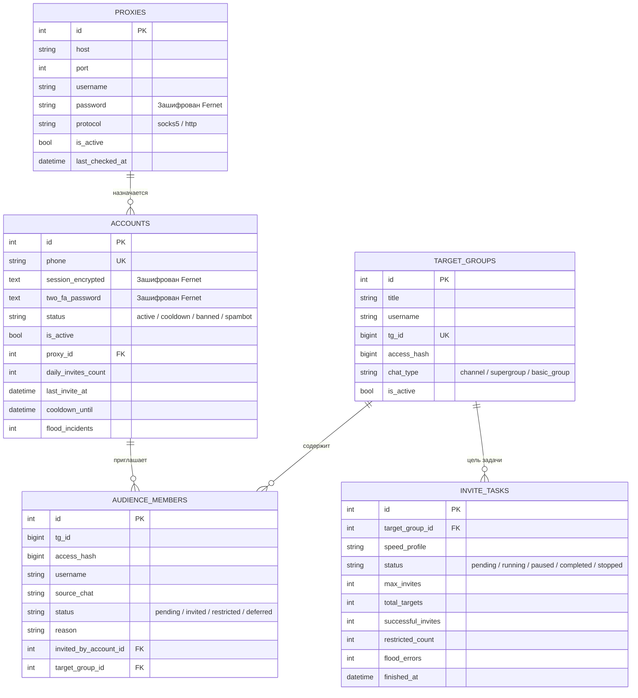

# Архитектура системы TG-Invite-Machine

Документ описывает техническое устройство, внутренние модули, алгоритмы обработки данных, схемы конвейеров инвайтинга и структуру базы данных TG-Invite-Machine версии v0.1.0-stable.

---

## 1. Обзор архитектуры

TG-Invite-Machine спроектирован по принципу разделения плоскости управления (Control Plane) и плоскости исполнения (Data Plane).

Плоскость управления реализована на фреймворке aiogram 3 и предоставляет интерактивный интерфейс администратора внутри Telegram. Плоскость исполнения состоит из пула асинхронных воркеров Telethon, изолированных через индивидуальные SOCKS5/HTTP прокси.

```
                  +----------------------------------------------+
                  |            Администратор Telegram            |
                  +----------------------+-----------------------+
                                         |
                                         | Telegram Bot API (HTTPS)
                                         v
                  +----------------------------------------------+
                  |         Control Plane (aiogram 3.x)          |
                  |                                              |
                  |  - AdminOnlyMiddleware (RBAC проверка ID)    |
                  |  - FSM контекст (сбор, лимиты, интервалы)    |
                  |  - Inline UI & Панель предстартовой настройки|
                  +----------------------+-----------------------+
                                         |
                                         v
                  +----------------------------------------------+
                  |           Сервисный слой и оркестратор       |
                  |                                              |
                  |  - InviterOrchestrator & TaskManager         |
                  |  - CollectorService (активные / все)         |
                  |  - AccountService & ProxyService             |
                  |  - SpamBotService & ExportService            |
                  +-----------+----------------------+-----------+
                              |                      |
                              v                      v
+-------------------------------+                  +-------------------------------+
|      Data & Storage Layer     |                  |   Data Plane (Telethon Pool)  |
|                               |                  |                               |
| - SQLite WAL / PostgreSQL     |                  | - Worker 1 -> SOCKS5 Прокси A |
| - SQLAlchemy 2.0 Async        |                  | - Worker 2 -> SOCKS5 Прокси B |
| - Fernet Cryptography Vault   |                  | - Worker N -> SOCKS5 Прокси N |
| - Strict Zero-Leak Policy     |                  | - MTProto Client Factory      |
+-------------------------------+                  +---------------+---------------+
                                                                   |
                                                                   | MTProto (TCP / SOCKS5)
                                                                   v
                                                   +-------------------------------+
                                                   |       Telegram Cloud API      |
                                                   +-------------------------------+
```

---

## 2. Модульная структура репозитория

```
tg-invite-machine/
├── app/
│   ├── bot/
│   │   ├── handlers/
│   │   │   ├── accounts.py       # Загрузка сессий, TData, ввод 2FA, аудит
│   │   │   ├── common.py         # Главное меню и системная статистика
│   │   │   ├── inviter.py        # Настройка лимитов, интервалов, запуск и контроль задач
│   │   │   ├── parser.py         # Настройка и запуск сбора участников
│   │   │   └── proxies.py        # Добавление и валидация SOCKS5/HTTP прокси
│   │   ├── middlewares/
│   │   │   └── auth.py           # Проверка прав администратора бота
│   │   ├── keyboards.py          # Меню, пагинация и чипы конфигурации
│   │   ├── states.py             # FSM состояния (AccountState, InviterState и др.)
│   │   └── main.py               # Точка входа Telegram-бота
│   │
│   ├── core/
│   │   ├── config.py             # Валидация настроек Pydantic v2
│   │   ├── database.py           # Инициализация SQLAlchemy, PRAGMA WAL, сессии
│   │   ├── security.py           # Шифрование Fernet, безопасная распаковка архивов
│   │   └── utils.py              # Нормализация юзернеймов, безопасное редактирование UI
│   │
│   ├── models/
│   │   └── models.py             # Модели: Account, Proxy, TargetGroup, AudienceMember, InviteTask
│   │
│   ├── services/
│   │   ├── account_service.py    # Регистрация и пакетный импорт аккаунтов
│   │   ├── collector_service.py  # Сбор участников по сообщениям и по алфавиту
│   │   ├── export_service.py     # Генерация отчетов Excel (.xlsx) и списков (.txt)
│   │   ├── inviter_service.py    # Оркестратор инвайтинга, расчет задержек, Circuit Breaker
│   │   ├── proxy_service.py      # Парсинг строковых прокси и TCP-проверка
│   │   ├── spambot_service.py    # Автоматический опрос @SpamBot для пула аккаунтов
│   │   └── task_manager.py       # Менеджер активных фоновых задач и UI-троттлинг
│   │
│   └── telegram/
│       ├── client_factory.py     # Создание клиентов Telethon со строгой привязкой к прокси
│       └── converter.py          # Конвертация TData (opentele2) и файлов .session
│
├── data/                         # Директория для inviter.db и экспортированных файлов
├── docs/                         # Техническая документация
├── tests/                        # Набор из 50 тестов pytest
├── Dockerfile                    # Сборка контейнера приложения
├── docker-compose.yml            # Сервисная конфигурация Docker
├── requirements.txt              # Зависимости Python
└── .env.example                  # Шаблон конфигурации
```

---

## 3. Жизненный цикл сессии и безопасность учетных данных

Система поддерживает два способа добавления рабочих номеров в пул: одиночный импорт и пакетную загрузку.

### Конвертация TData через opentele2
При загрузке архива TData (`.zip`):
1. Метод `safe_extract_zip` распаковывает архив во временный каталог, проверяя канонические пути и защищая файловую систему от атак Zip-Slip и Zip-Bomb.
2. Библиотека `opentele2` инициализирует объект `TDesktop`.
3. Вызов `tdesk.ToTelethon(flag=CreateNewSession, password=..., proxy=...)` создает новую сессионную пару ключей с корректным DC без генерации ошибки `AUTH_KEY_DUPLICATED`.
4. Сессионная строка извлекается через `StringSession.save()` и сразу шифруется ключом Fernet.
5. Исходные временные файлы удаляются с диска.

### Двухэтапная аутентификация (2FA)
Если при конвертации TData или чтении файла `.session` библиотека Telegram фиксирует наличие облачного пароля:
1. Вызов возвращает маркер `tdata_password_required`.
2. Бот переходит в состояние `AccountState.waiting_for_password` и запрашивает пароль у администратора.
3. При получении пароля бот немедленно удаляет входящее сообщение (`await message.delete()`), чтобы исключить сохранение учетных данных в открытом виде в чате.
4. Пароль шифруется Fernet и сохраняется в поле `Account.two_fa_password`.

### Сетевая изоляция (Zero-Leak)
Вся сетевая активность рабочих аккаунтов строго привязана к их прокси:
- При включенной настройке `REQUIRE_STRICT_PROXIES=true` фабрика клиентов `client_factory.py` выбрасывает исключение `ProxySecurityError`, если прокси отсутствует или деактивирован.
- Аккаунт ни при каких условиях не выполняет сетевые вызовы с реального IP адреса сервера.

---

## 4. Конвейер инвайтинга и защита от банов

Оркестратор `InviterOrchestrator` управляет распределенным процессом добавления пользователей:



### Моделирование органических задержек
Функция `calculate_delay` вычисляет задержку между действиями по тримодальной схеме:
- 25% случаев: быстрый клик (диапазон `0.7 * min_delay` до `min_delay`).
- 60% случаев: средний темп (диапазон `min_delay` до `max_delay`).
- 15% случаев: длинная пауза (диапазон `max_delay` до `1.5 * max_delay`).

При кастомном профиле (`custom:min:max`) границы задаются администратором в секундах, сохраняя пропорции тримодального распределения.

### Circuit Breaker
Если в течение 30-минутного скользящего окна фиксируется серия флуд-ошибок, превышающая `CIRCUIT_BREAKER_FLOOD_THRESHOLD`, оркестратор переводит задачу в статус `paused`. Это исключает массовый выход пула сессий из строя при изменении антиспам-политики целевого чата.

---

## 5. Схема базы данных



### Конкурентность и настройки SQLite
Для предотвращения блокировок файла при совместной работе бота и воркеров применяются прагмы:
- `PRAGMA journal_mode=WAL;`
- `PRAGMA synchronous=NORMAL;`
- `connect_args={"timeout": 15}`
